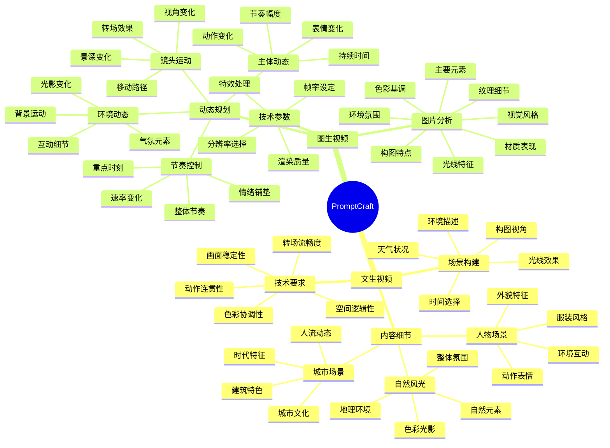
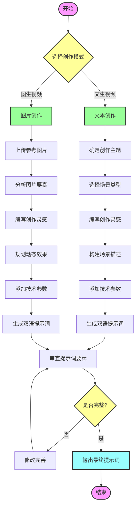

# PromptCraft - AI视频生成提示词工程

PromptCraft是一个专业的AI视频生成提示词指南项目，旨在帮助创作者更好地使用AI视频生成工具（如Sora、即梦AI等）创作高质量的视频内容。

## 项目简介

本项目提供了两种核心功能：
1. 文本到视频（Text-to-Video）提示词指南
2. 图像到视频（Image-to-Video）提示词指南

每个功能都提供中英双语版本，帮助创作者编写专业、规范的提示词。

## 文档结构

```
PromptCraft/
├── README.md                                # 项目说明文档
├── text_to_video_prompt_guide_cn.md        # 文生视频提示词指南（中文版）
├── text_to_video_prompt_guide_en.md        # 文生视频提示词指南（英文版）
├── image_to_video_prompt_guide_cn.md       # 图生视频提示词指南（中文版）
└── image_to_video_prompt_guide_en.md       # 图生视频提示词指南（英文版）
```

## 功能特点

### 1. 文生视频提示词指南
- 专业的场景构建指导
- 详细的内容细节描述框架
- 规范的技术参数设置建议
- 完整的提示词模板和示例
- 字数限制和格式规范

### 2. 图生视频提示词指南
- 专业的图片分析方法
- 系统的动态规划框架
- 完整的技术要求说明
- 标准化的提示词模板
- 实用的示例展示

## 使用说明

### 提示词格式规范
1. 创作灵感：20字以内
2. 中文提示词：500字以内
3. 英文提示词：500词以内
4. 涵盖要素描述：每项15字以内

### 必要元素清单
- 场景时间
- 场景环境
- 主体特征
- 场景细节
- 光线氛围
- 技术规格
- 专业效果
- 调色风格
- 情感表达

## 最佳实践

1. 按照指南提供的模板编写提示词
2. 确保包含所有必要元素
3. 遵守字数限制要求
4. 保持描述的专业性和准确性
5. 注意技术参数的合理性


## 项目脑图



## 使用流程


## 贡献指南

欢迎通过以下方式参与项目改进：
1. 提交Issue报告问题或建议
2. 提交Pull Request完善文档内容
3. 分享使用经验和成功案例

## 许可证

本项目采用 MIT 许可证。详见 LICENSE 文件。

## 联系方式

如有问题或建议，请通过以下方式联系：
- 提交Issue
- 发送邮件至：[yuanyang613@163.com]

## 致谢

感谢所有为本项目提供建议和反馈的创作者们。
